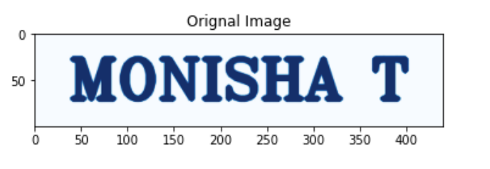
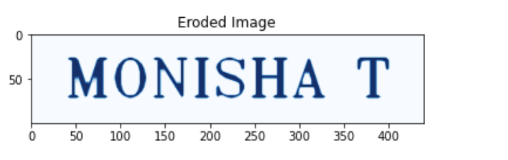
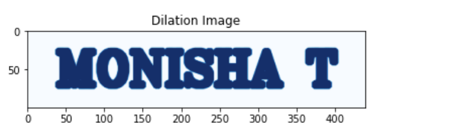

# Implementation-of-Erosion-and-Dilation
## Aim
To implement Erosion and Dilation using Python and OpenCV.
## Software Required
1. Anaconda - Python 3.7
2. OpenCV
## Algorithm:

### Step1:

Import the necessary packages.

### Step2:

Create the text image using cv2.putText.

### Step3:

Then create the structuring image for dilation/erosion

### Step4:

Apply erosion and dilation using cv2.erode and cv2.dilate

### Step5:

Plot the images using plt.imshow

 
## Program:

``` Python

# Import the necessary packages

import cv2
import numpy as np
import matplotlib.pyplot as plt


# Create the Text using cv2.putText

text_image = np.zeros((100,440),dtype = 'uint8')
font = cv2.FONT_HERSHEY_TRIPLEX = 4
cv2.putText(text_image," MONISHA T",(5,70),font,2,(255),5,cv2.LINE_AA)
plt.imshow(text_image,'Blues')
plt.title("Orignal Image")


# Create the structuring element

kernal = np.ones((5,5),np.uint8)

# Erode the image

image_erode = cv2.erode(text_image,kernal)
plt.title("Eroded Image")
plt.imshow(image_erode,'Blues')


# Dilate the image

image_dilate = cv2.dilate(text_image,kernal)
plt.title("Dilation Image")
plt.imshow(image_dilate,'Blues')


```
## Output:

### Display the input Image



### Display the Eroded Image



### Display the Dilated Image



## Result
Thus the generated text image is eroded and dilated using python and OpenCV.